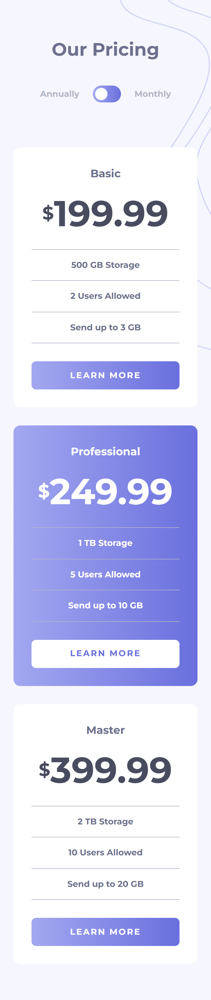
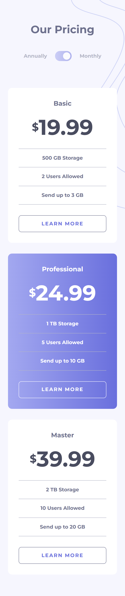
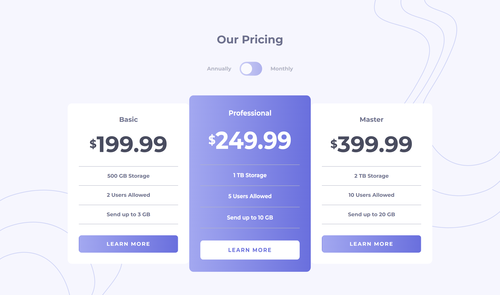
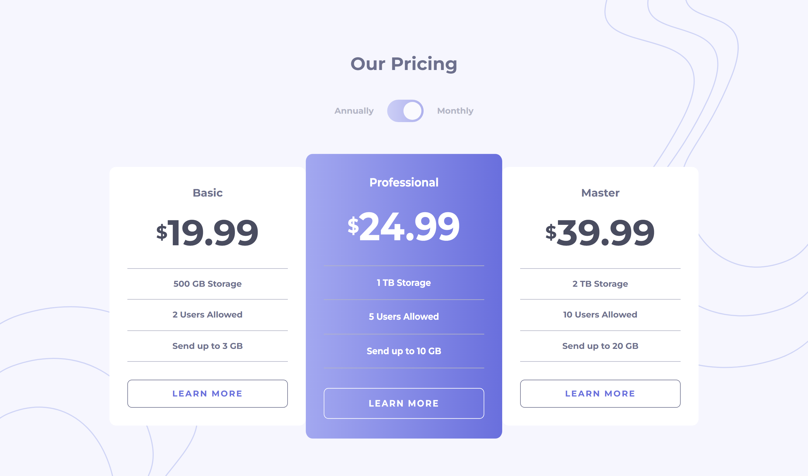

# Frontend Mentor - Pricing component with toggle solution

This is a solution to the [Pricing component with toggle challenge on Frontend Mentor](https://www.frontendmentor.io/challenges/pricing-component-with-toggle-8vPwRMIC). Frontend Mentor challenges help you improve your coding skills by building realistic projects.

## Table of contents

- [Overview](#overview)
  - [The challenge](#the-challenge)
  - [Screenshot](#screenshot)
  - [Links](#links)
- [My process](#my-process)
  - [Built with](#built-with)
  - [What I learned](#what-i-learned)
  - [Continued development](#continued-development)
- [Author](#author)

## Overview

This is the first challenge in the **Intro to Javascript Frameworks Frontend Mentor Roadmap**. the challenge consists of a pricing table with a toggle switch to switch between the monthly / yearly prices.

### The challenge

Users should be able to:

- View the optimal layout for the component depending on their device's screen size
- Control the toggle with both their mouse/trackpad and their keyboard
- **Bonus**: Complete the challenge with just HTML and CSS (can't really do that since I'm using react)

### Screenshot

#### Mobile

##### Monthly View

##### Yearly View

##### Active States View

#### Desktop

##### Monthly View

##### Yearly View

##### Active States View

### Links

- Solution URL: [Add solution URL here](https://your-solution-url.com)
- Live Site URL: [Add live site URL here](https://your-live-site-url.com)

## My process

### Built with

- Semantic HTML5 markup
- CSS custom properties
- Flexbox
- CSS Grid
- Mobile-first workflow
- [React](https://reactjs.org/) - JS library
- [TypeScript](https://www.typescriptlang.org/) - Type Checking Language Built on top of Javascript.
- [Vite](https://vitejs.dev/) - Bundler and development environment for Frontend.

### What I learned

This is the first project in which I used a framework which is **React** in this case. I thought I only needed to learn react to get started on this roadmap. but I had to also introduce myself to a bundler the most popular one currently seems to be **Vite** it provides fast server startup time and fast hot module replacement along a ton of additional feature (SSR, backend integration and so on).

To complete the tooling I studied also **TypeScript**. which add strongly typing to JavaScript a piece that let's you avoid ton of runtime errors and result in more readable and understandable code.

the jump from HTML / CSS / JS to using all of these tools in this project was a bit overwhelming. Since this is a simple project I was tempted to think that it would be better to just use plain JS + HTML + CSS. but just from this simple project I could see the benefits of using React with TypeScript.

I used one component for the Toggle and one component for the Card. And I used `useState` hook to keep track of the toggle State and pass that to the other components to show the _yearly_ vs _monthly_ prices. and move the toggle button to the other side.

In terms of CSS I only used two CSS files like I'm used to doing with plain JS. I first thought of using CSS Modules. but it seemed easier to me to just stick everything into one CSS file and use BEM classes to style the different elements of my components.

### Continued development

I'd like to continue using this setup (React + TypeScript + Vite) to complete this Roadmap. I think this will give me a good idea and practice of using _React + TypeScript_ in a non fullstack framework. After that I can take a look at fullstack frameworks like Next.js or Remix.

## Author

- Frontend Mentor - [@ilyesab](https://www.frontendmentor.io/profile/ilyesab)
